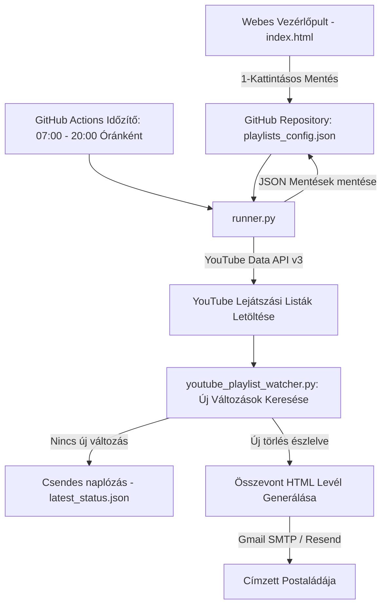

# YouTube Playlist Watcher 🎵

Automatizált, felhőalapú YouTube lejátszási lista változás-figyelő és mentő rendszer.  
Ha egy dal törlődik, priváttá válik vagy eltűnik bármelyik figyelt listádról, a rendszer azonnal megkeresi a mentett adatbázisból a dal **valódi, teljes címét és előadóját**, és közvetlen e-mail értesítést küld a megadott címzettnek.

---

## ✨ Főbb funkciók

- 🌌 **SevenGrid Aurora Dark Mode Vezérlőpult:**  
  Modern, letisztult webes admin felület (GitHub Pages alapú), pixel-pontos tipográfiával és finom fényeffektekkel.
- 📋 **Intelligens Link-ellenőrzés & Vágólap beillesztés:**  
  Valós idejű YouTube Data API integráció: egyetlen kattintással beilleszti a másolt linket, azonnal beolvassa a lista hivatalos nevét, és kiszűri a téves, sima videó linkeket vagy a privát listákat.
- 👥 **Több Lejátszási Lista & Címzett kezelése:**  
  Tetszőleges számú lejátszási lista felvétele, listánként egyedi értesítési e-mail címmel (pl. saját és ismerősök listái külön-külön).
- 📬 **Összevont (Consolidated) Értesítő E-mailek:**  
  Ha egy címzetthez tartozó több listában is történik változás, nem küld külön-külön leveleket, hanem 1 db elegáns, elválasztóvonalakkal tagolt összefoglaló e-mailt kézbesít.
- 🕒 **Nappali Óránkénti Ellenőrzés (07:00 – 20:00):**  
  A GitHub Actions felhőben reggel 7 és este 8 között óránként automatikusan lefut az ellenőrzés. Éjszaka (20:00 és 07:00 között) csendben marad, nem zavarja az alvást.
- 🛡️ **Új Változások Intelligens Észlelése:**  
  A rendszer különbséget tesz a már régen törölt videók és az **újonnan eltűnő dalok** között. A már meglévő szürke elemekről nem küld felesleges értesítést, de amint egy jelenleg élő dal törlődik, a tegnapi mentésből azonnal kinyeri a dal **pontos címét**.
- ✉️ **Gmail SMTP & Resend API Kézbesítés:**  
  Közvetlen Gmail SMTP kézbesítés (App Password hitelesítéssel), tartalék Resend API támogatással.
- 🧹 **Automatikus Tárhely- és Mentéskezelés:**  
  A beépített `purge-dumps` mechanizmus mindig csak a legutolsó 30 db JSON mentést tartja meg, így a GitHub repó mérete mindössze pár megabájt marad, és soha nem telik meg.

---

## 🏗️ Rendszerarchitektúra és Működés

---

## 📁 Projekt Fájlszerkezet

| Fájl | Leírás |
| :--- | :--- |
| **`index.html`** | A SevenGrid Dark Mode stílusú webes vezérlőpult. Kezeli a lejátszási listák hozzáadását, törlését, a PIN kóddal védett belépést, és a GitHub API szinkronizációt. |
| **`runner.py`** | A központi vezérlő Python script. Beolvassa a `playlists_config.json` konfigurációt, meghívja a figyelő motort az összes listára, csoportosítja a változásokat címzettek szerint, és kiküldi az e-maileket. |
| **`youtube_playlist_watcher.py`** | A YouTube Data API v3 letöltő és diff-összehasonlító motorja. Kezeli a JSON pillanatképeket és detektálja az állapotváltozásokat. |
| **`playlists_config.json`** | A figyelt lejátszási listák és a hozzájuk rendelt e-mail címek központi adatbázisa. |
| **`latest_status.json`** | A legutóbbi felhőbeli futás állapotjelentése (a webes felület ezen keresztül mutatja a legfrissebb logot). |
| **`.github/workflows/daily_watcher.yml`** | A GitHub Actions automatizációs munkafolyamat, amely óránként lefut a felhőben. |

---

## ⚙️ Beállítás & Környezeti Változók (GitHub Secrets)

A rendszer teljes körű működéséhez a GitHub repository **Settings ➡️ Secrets and variables ➡️ Actions** menüpontjában az alábbi kulcsok vannak beállítva:

| Secret Név | Leírás |
| :--- | :--- |
| `YOUTUBE_API_KEY` | Google Cloud YouTube Data API v3 kulcs a listák lekéréséhez. |
| `SMTP_SERVER` | `smtp.gmail.com` |
| `SMTP_PORT` | `587` |
| `SMTP_USER` | A küldő Gmail címe (pl. `tamas.duffek@gmail.com`). |
| `SMTP_PASSWORD` | A Google Fiókban generált 16 jegyű **Alkalmazásjelszó** (*App Password*). |
| `FROM_EMAIL` | Feladó megjelenített címe (`YouTube watcher <tamas.duffek@gmail.com>`). |
| `RESEND_API_KEY` | *(Opcionális)* Tartalék Resend API kulcs. |

---

## 🔒 Webes Adminisztráció & GitHub Token

A weboldal (**GitHub Pages**) közvetlenül képes kommunikálni a GitHub API-val:
1. Nyisd meg a weboldalt a böngésződben.
2. A **`Beállítások`** menüpontban add meg a GitHub Personal Access Token-edet (`repo` és `workflow` jogosultsággal).
3. A token kizárólag a te saját böngésződben tárolódik (`localStorage`).
4. Így a **`Szinkronizálás`** gomb vagy az új listák hozzáadása azonnal frissíti a felhőt és a háttérben elindítja az ellenőrzést.

---

## 📜 Licenc

MIT License.
